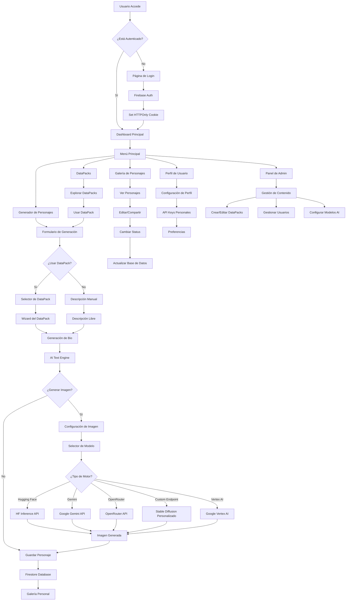
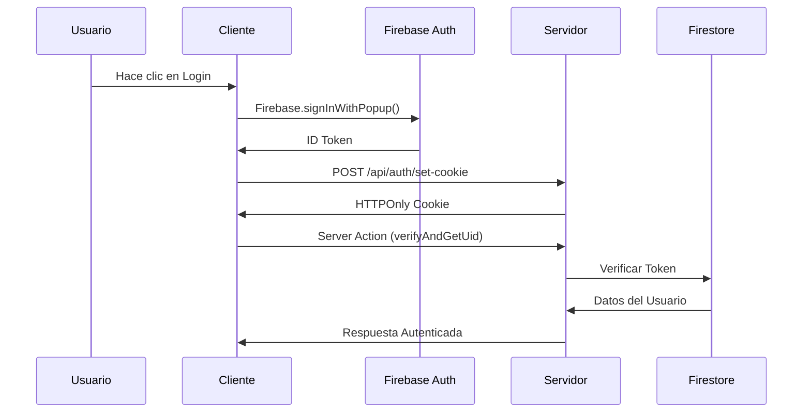
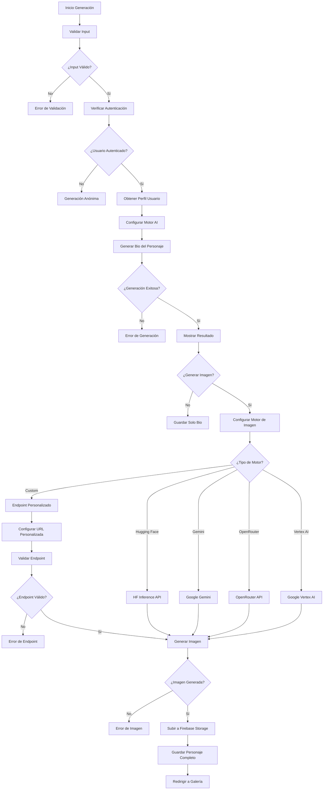
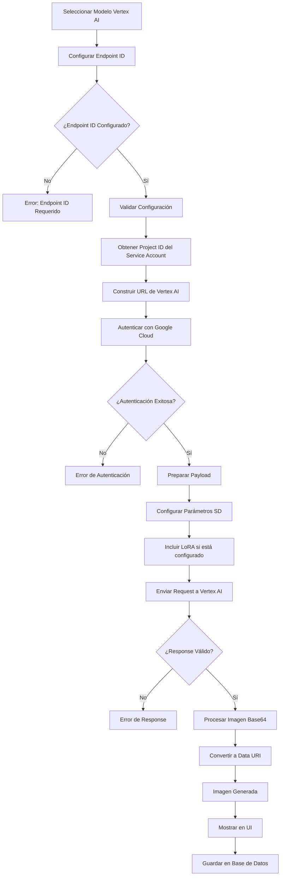
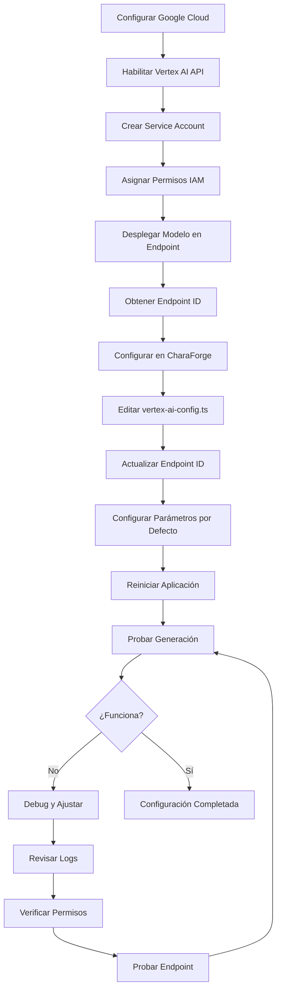
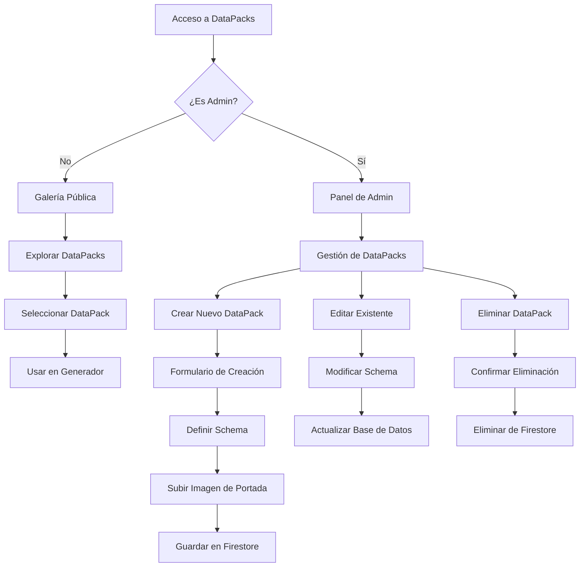
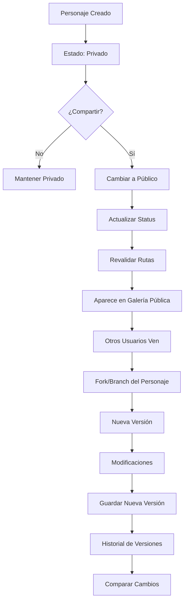
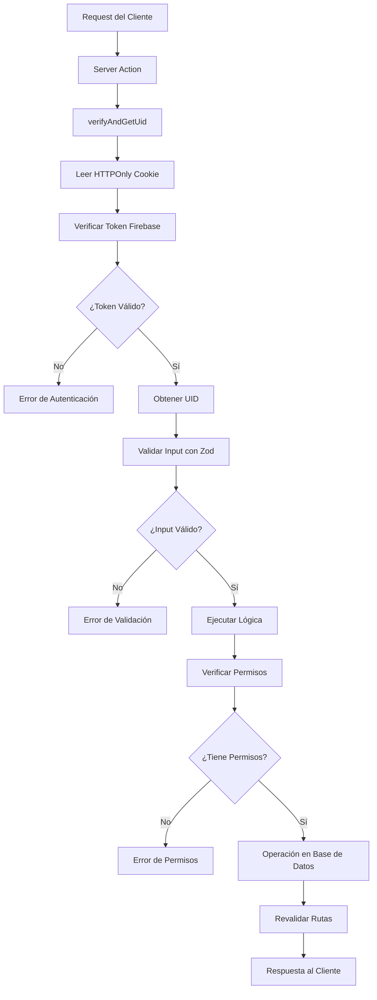

# 🔄 Flujo de Uso de CharaForge

## Diagrama General del Flujo de la Aplicación

## 🔐 Flujo de Autenticación

## 🤖 Flujo de Generación de Personajes

## 🎨 Flujo de Vertex AI Model Garden (NUEVO)

## 🔧 Flujo de Configuración de Vertex AI

## 📦 Flujo de DataPacks

## 🔄 Flujo de Versionado y Compartir

## 🛡️ Flujo de Seguridad

## 📊 Puntos de Inconsistencia Potenciales

### 1. **Gestión de Estado**
- **Problema**: Uso de `useTransition` y estado local puede causar desincronización
- **Ubicación**: `character-generator.tsx` líneas 95-100
- **Riesgo**: Estado inconsistente entre generación y guardado

### 2. **Validación de Datos**
- **Problema**: Validación duplicada en cliente y servidor
- **Ubicación**: Schemas Zod en múltiples archivos
- **Riesgo**: Inconsistencias entre validaciones

### 3. **Manejo de Errores**
- **Problema**: Diferentes formatos de error en diferentes acciones
- **Ubicación**: `generation.ts`, `character-write.ts`
- **Riesgo**: UX inconsistente en manejo de errores

### 4. **Revalidación de Rutas**
- **Problema**: Revalidación manual inconsistente
- **Ubicación**: Múltiples Server Actions
- **Riesgo**: Cache desactualizado

### 5. **Gestión de Archivos**
- **Problema**: Lógica de upload dispersa
- **Ubicación**: `storage.ts` vs Server Actions
- **Riesgo**: Inconsistencias en manejo de archivos

### 6. **Autenticación**
- **Problema**: Verificación de autenticación en múltiples puntos
- **Ubicación**: `verifyAndGetUid` en cada acción
- **Riesgo**: Lógica duplicada y posible inconsistencia

### 7. **Endpoints Personalizados (NUEVO)**
- **Problema**: Validación de endpoints personalizados no centralizada
- **Ubicación**: `custom-endpoints.ts` y `character-image/flow.ts`
- **Riesgo**: Inconsistencias en configuración y manejo de errores

## 🎯 Recomendaciones para Mejorar Consistencia

1. **Centralizar Gestión de Estado**: Usar un store global (Zustand/Redux)
2. **Estandarizar Validación**: Crear validadores reutilizables
3. **Unificar Manejo de Errores**: Implementar sistema de errores consistente
4. **Automatizar Revalidación**: Usar middleware de revalidación
5. **Consolidar Lógica de Archivos**: Centralizar en servicios únicos
6. **Implementar Middleware de Auth**: Verificación automática en rutas protegidas
7. **Centralizar Configuración de Endpoints**: Sistema unificado para gestión de endpoints personalizados
8. **Validación Automática de Endpoints**: Health checks automáticos para endpoints personalizados