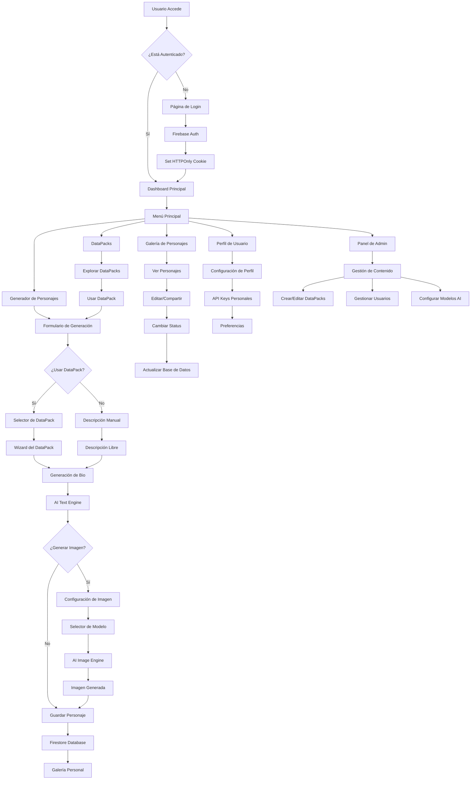
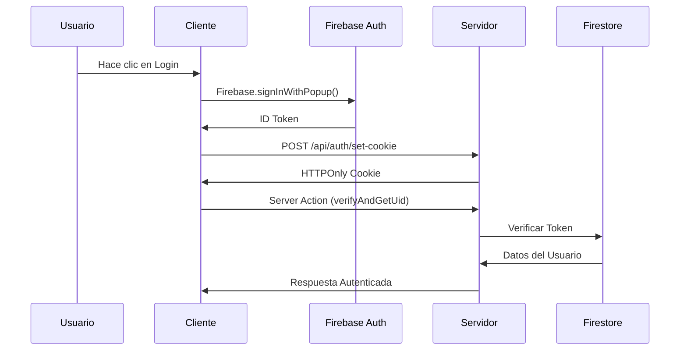
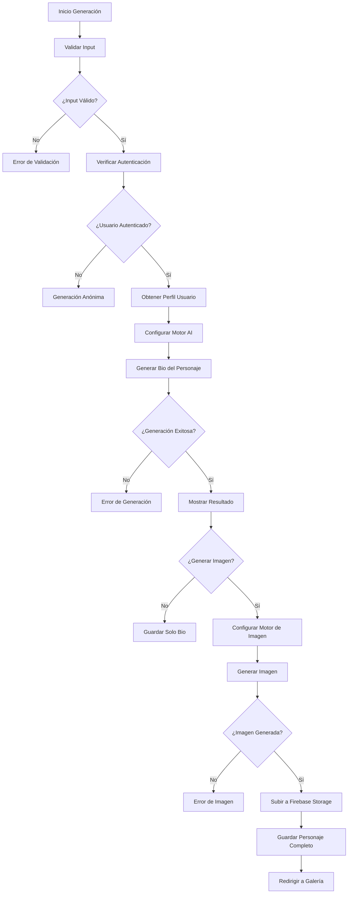
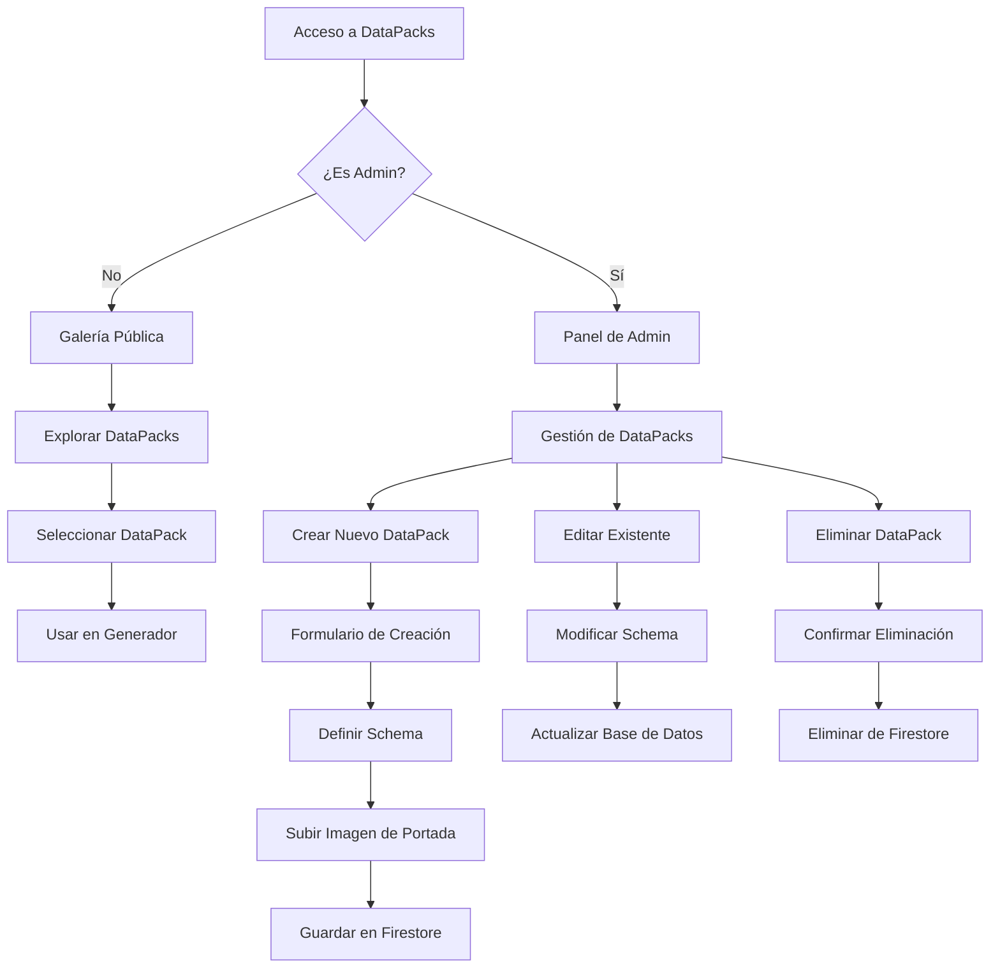
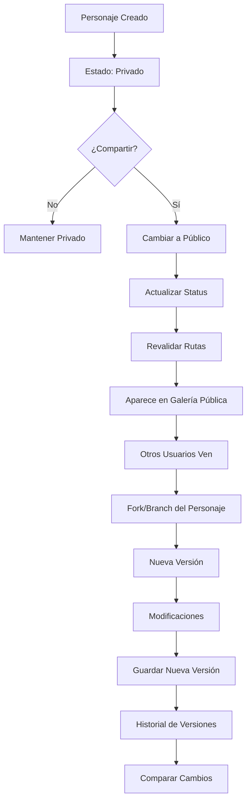
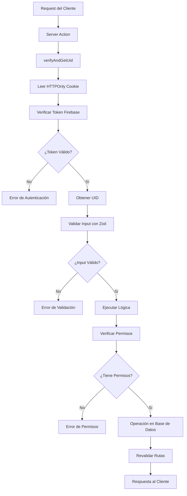

# 🔄 Flujo de Uso de CharaForge

## Diagrama General del Flujo de la Aplicación

```mermaid
graph TD
    A[Usuario Accede] --> B{¿Está Autenticado?}
    B -->|No| C[Página de Login]
    B -->|Sí| D[Dashboard Principal]
    
    C --> E[Firebase Auth]
    E --> F[Set HTTPOnly Cookie]
    F --> D
    
    D --> G[Menú Principal]
    G --> H[Generador de Personajes]
    G --> I[Galería de Personajes]
    G --> J[DataPacks]
    G --> K[Perfil de Usuario]
    G --> L[Panel de Admin]
    
    H --> M[Formulario de Generación]
    M --> N{¿Usar DataPack?}
    N -->|Sí| O[Selector de DataPack]
    N -->|No| P[Descripción Manual]
    
    O --> Q[Wizard del DataPack]
    P --> R[Descripción Libre]
    
    Q --> S[Generación de Bio]
    R --> S
    
    S --> T[AI Text Engine]
    T --> U{¿Generar Imagen?}
    U -->|Sí| V[Configuración de Imagen]
    U -->|No| W[Guardar Personaje]
    
    V --> X[Selector de Modelo]
    X --> Y[AI Image Engine]
    Y --> Z[Imagen Generada]
    Z --> W
    
    W --> AA[Firestore Database]
    AA --> BB[Galería Personal]
    
    I --> CC[Ver Personajes]
    CC --> DD[Editar/Compartir]
    DD --> EE[Cambiar Status]
    EE --> FF[Actualizar Base de Datos]
    
    J --> GG[Explorar DataPacks]
    GG --> HH[Usar DataPack]
    HH --> M
    
    K --> II[Configuración de Perfil]
    II --> JJ[API Keys Personales]
    JJ --> KK[Preferencias]
    
    L --> LL[Gestión de Contenido]
    LL --> MM[Crear/Editar DataPacks]
    LL --> NN[Gestionar Usuarios]
    LL --> OO[Configurar Modelos AI]
```

## 🔐 Flujo de Autenticación

```mermaid
sequenceDiagram
    participant U as Usuario
    participant C as Cliente
    participant F as Firebase Auth
    participant S as Servidor
    participant DB as Firestore
    
    U->>C: Hace clic en Login
    C->>F: Firebase.signInWithPopup()
    F->>C: ID Token
    C->>S: POST /api/auth/set-cookie
    S->>C: HTTPOnly Cookie
    C->>S: Server Action (verifyAndGetUid)
    S->>DB: Verificar Token
    DB->>S: Datos del Usuario
    S->>C: Respuesta Autenticada
```

## 🤖 Flujo de Generación de Personajes

```mermaid
flowchart TD
    A[Inicio Generación] --> B[Validar Input]
    B --> C{¿Input Válido?}
    C -->|No| D[Error de Validación]
    C -->|Sí| E[Verificar Autenticación]
    
    E --> F{¿Usuario Autenticado?}
    F -->|No| G[Generación Anónima]
    F -->|Sí| H[Obtener Perfil Usuario]
    
    H --> I[Configurar Motor AI]
    I --> J[Generar Bio del Personaje]
    J --> K{¿Generación Exitosa?}
    K -->|No| L[Error de Generación]
    K -->|Sí| M[Mostrar Resultado]
    
    M --> N{¿Generar Imagen?}
    N -->|No| O[Guardar Solo Bio]
    N -->|Sí| P[Configurar Motor de Imagen]
    
    P --> Q[Generar Imagen]
    Q --> R{¿Imagen Generada?}
    R -->|No| S[Error de Imagen]
    R -->|Sí| T[Subir a Firebase Storage]
    
    T --> U[Guardar Personaje Completo]
    U --> V[Redirigir a Galería]
```

## 📦 Flujo de DataPacks

```mermaid
flowchart TD
    A[Acceso a DataPacks] --> B{¿Es Admin?}
    B -->|No| C[Galería Pública]
    B -->|Sí| D[Panel de Admin]
    
    C --> E[Explorar DataPacks]
    E --> F[Seleccionar DataPack]
    F --> G[Usar en Generador]
    
    D --> H[Gestión de DataPacks]
    H --> I[Crear Nuevo DataPack]
    H --> J[Editar Existente]
    H --> K[Eliminar DataPack]
    
    I --> L[Formulario de Creación]
    L --> M[Definir Schema]
    M --> N[Subir Imagen de Portada]
    N --> O[Guardar en Firestore]
    
    J --> P[Modificar Schema]
    P --> Q[Actualizar Base de Datos]
    
    K --> R[Confirmar Eliminación]
    R --> S[Eliminar de Firestore]
```

## 🔄 Flujo de Versionado y Compartir

```mermaid
flowchart TD
    A[Personaje Creado] --> B[Estado: Privado]
    B --> C{¿Compartir?}
    C -->|No| D[Mantener Privado]
    C -->|Sí| E[Cambiar a Público]
    
    E --> F[Actualizar Status]
    F --> G[Revalidar Rutas]
    G --> H[Aparece en Galería Pública]
    
    H --> I[Otros Usuarios Ven]
    I --> J[Fork/Branch del Personaje]
    J --> K[Nueva Versión]
    K --> L[Modificaciones]
    L --> M[Guardar Nueva Versión]
    
    M --> N[Historial de Versiones]
    N --> O[Comparar Cambios]
```

## 🛡️ Flujo de Seguridad

```mermaid
flowchart TD
    A[Request del Cliente] --> B[Server Action]
    B --> C[verifyAndGetUid]
    C --> D[Leer HTTPOnly Cookie]
    D --> E[Verificar Token Firebase]
    E --> F{¿Token Válido?}
    F -->|No| G[Error de Autenticación]
    F -->|Sí| H[Obtener UID]
    
    H --> I[Validar Input con Zod]
    I --> J{¿Input Válido?}
    J -->|No| K[Error de Validación]
    J -->|Sí| L[Ejecutar Lógica]
    
    L --> M[Verificar Permisos]
    M --> N{¿Tiene Permisos?}
    N -->|No| O[Error de Permisos]
    N -->|Sí| P[Operación en Base de Datos]
    
    P --> Q[Revalidar Rutas]
    Q --> R[Respuesta al Cliente]
```

## 📊 Puntos de Inconsistencia Potenciales

### 1. **Gestión de Estado**
- **Problema**: Uso de `useTransition` y estado local puede causar desincronización
- **Ubicación**: `character-generator.tsx` líneas 95-100
- **Riesgo**: Estado inconsistente entre generación y guardado

### 2. **Validación de Datos**
- **Problema**: Validación duplicada en cliente y servidor
- **Ubicación**: Schemas Zod en múltiples archivos
- **Riesgo**: Inconsistencias entre validaciones

### 3. **Manejo de Errores**
- **Problema**: Diferentes formatos de error en diferentes acciones
- **Ubicación**: `generation.ts`, `character-write.ts`
- **Riesgo**: UX inconsistente en manejo de errores

### 4. **Revalidación de Rutas**
- **Problema**: Revalidación manual inconsistente
- **Ubicación**: Múltiples Server Actions
- **Riesgo**: Cache desactualizado

### 5. **Gestión de Archivos**
- **Problema**: Lógica de upload dispersa
- **Ubicación**: `storage.ts` vs Server Actions
- **Riesgo**: Inconsistencias en manejo de archivos

### 6. **Autenticación**
- **Problema**: Verificación de autenticación en múltiples puntos
- **Ubicación**: `verifyAndGetUid` en cada acción
- **Riesgo**: Lógica duplicada y posible inconsistencia

## 🎯 Recomendaciones para Mejorar Consistencia

1. **Centralizar Gestión de Estado**: Usar un store global (Zustand/Redux)
2. **Estandarizar Validación**: Crear validadores reutilizables
3. **Unificar Manejo de Errores**: Implementar sistema de errores consistente
4. **Automatizar Revalidación**: Usar middleware de revalidación
5. **Consolidar Lógica de Archivos**: Centralizar en servicios únicos
6. **Implementar Middleware de Auth**: Verificación automática en rutas protegidas